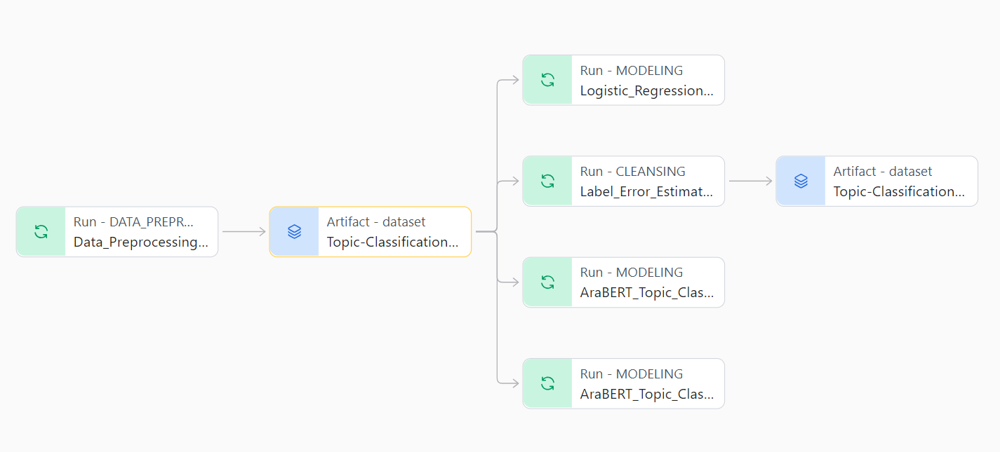

# Disambiguation Study for Arabic Applied on Text Classification

## Setup

This environment is setup to work on a Linux platform. Make sure to use WSL2 on windows.

- Install developer tools for C++ package building.

```bash
sudo apt install build-essential
```

- Install Java to work with AraBERT preprocessors.

```bash
sudo apt install default-jre
```

- Download and install Miniconda

```bash
wget https://repo.anaconda.com/miniconda/Miniconda3-latest-Linux-x86_64.sh
bash Miniconda3-latest-Linux-x86_64.sh -b -p ./miniconda
```

- Activate conda `base` env

```bash
source ./miniconda/bin/activate
```

- Create **disambg** env from [YAML](./environment.yml) file

```bash
conda env create -f environment.yml
conda activate disambg
```

- Fill [.ENV.EXAMPLE](./.env.example) file and save it into `.env` file

- Download Pretrained FastText model for baseline calculations

```bash
cd models
python ../download_fasttext_model.py ar
rm cc.ar.300.bin.gz
cd ..
```

## Topic Classification Results

### Accuracy


### Macro-F1


## W&B Workspace

- [Workspace Link](https://wandb.ai/e_hossam96/ARABIC_DISAMBIGUATION_STUDY?nw=nwusere_hossam96)

- [Topic Classification Data Lineage Link](https://wandb.ai/e_hossam96/ARABIC_DISAMBIGUATION_STUDY/artifacts/dataset/Topic-Classification-Dataset/v0/lineage)


